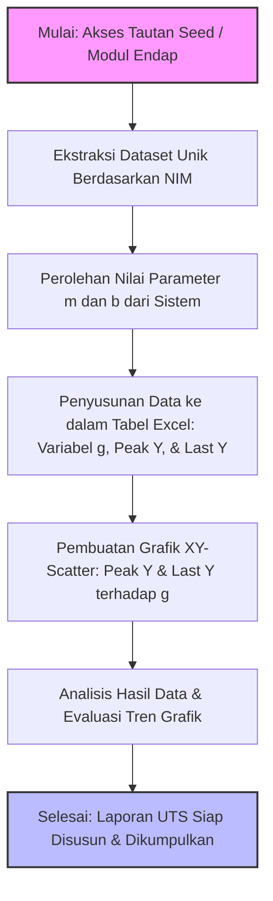

```mermaid
graph TD
    A[Mulai: Akses Tautan Seed / Modul Endap] --> B[Ekstraksi Dataset Unik Berdasarkan NIM]
    B --> C[Perolehan Nilai Parameter m dan b dari Sistem]
    C --> D[Penyusunan Data ke dalam Tabel Excel: Variabel g, Peak Y, & Last Y]
    D --> E[Pembuatan Grafik XY-Scatter: Peak Y & Last Y terhadap g]
    E --> F[Analisis Hasil Data & Evaluasi Tren Grafik]
    F --> G[Selesai: Laporan UTS Siap Disusun & Dikumpulkan]

    style A fill:#f9f,stroke:#333,stroke-width:2px
    style G fill:#bbf,stroke:#333,stroke-width:2px
```
