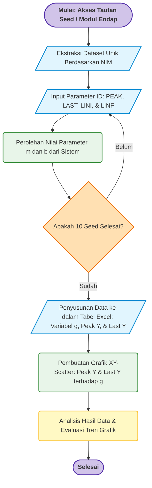

```mermaid
graph TD
    %% Pengaturan Gaya Node yang Estetik dan Bermakna
    classDef startEnd fill:#d1c4e9,stroke:#512da8,stroke-width:2px,rx:25,ry:25,font-weight:bold;
    classDef ioNode fill:#e1f5fe,stroke:#0288d1,stroke-width:2px,rx:5,ry:5;
    classDef processNode fill:#e8f5e9,stroke:#388e3c,stroke-width:2px,rx:5,ry:5;
    classDef analysisNode fill:#fff9c4,stroke:#fbc02d,stroke-width:2px,rx:5,ry:5;
    classDef decisionNode fill:#ffe0b2,stroke:#ef6c00,stroke-width:2px;

    %% Alur Diagram Utama dengan Perulangan & Selesai
    A([Mulai: Akses Tautan Seed / Modul Endap]) --> B[/Ekstraksi Dataset Unik Berdasarkan NIM/]
    B --> C[/Input Parameter ID: PEAK, LAST, LINI, & LINF/]
    C --> D[Perolehan Nilai Parameter m dan b dari Sistem]
    
    %% Pengecekan Kondisi (Looping 10 Seed)
    D --> E{Apakah 10 Seed Selesai?}
    E -- Belum --> C
    E -- Sudah --> F[/Penyusunan Data ke dalam Tabel Excel: Variabel g, Peak Y, & Last Y/]
    
    F --> G[Pembuatan Grafik XY-Scatter: Peak Y & Last Y terhadap g]
    G --> H[Analisis Hasil Data & Evaluasi Tren Grafik]
    H --> I([Selesai])

    %% Penerapan Gaya
    class A,I startEnd;
    class B,C,F ioNode;
    class D,G processNode;
    class H analysisNode;
    class E decisionNode;
```
